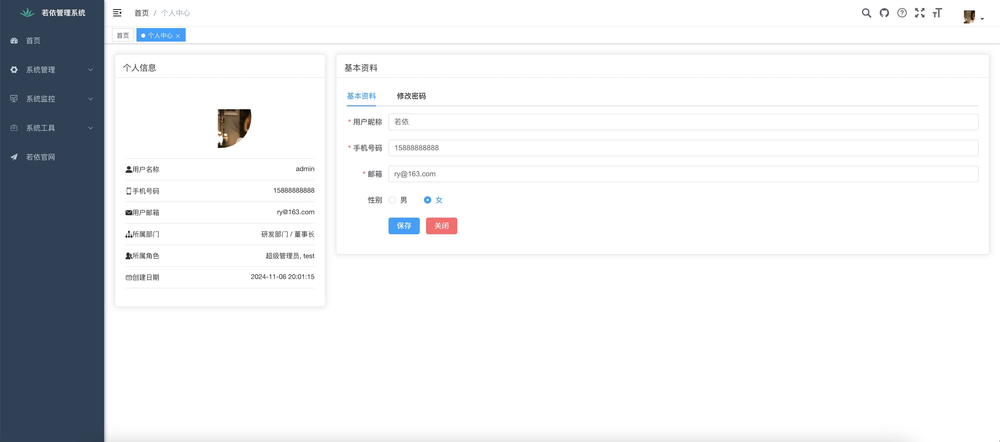
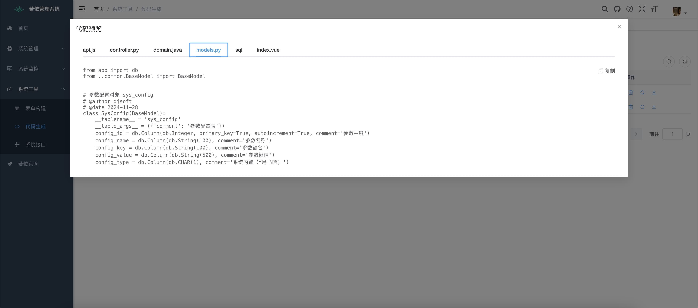
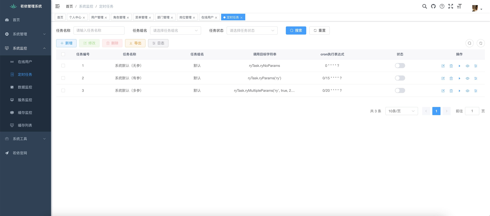
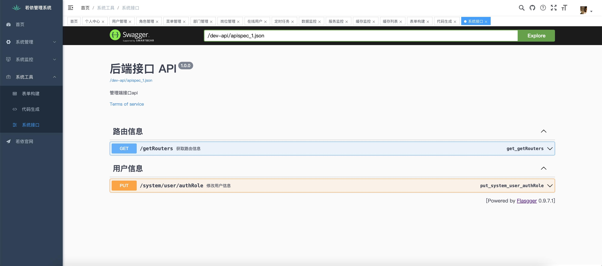
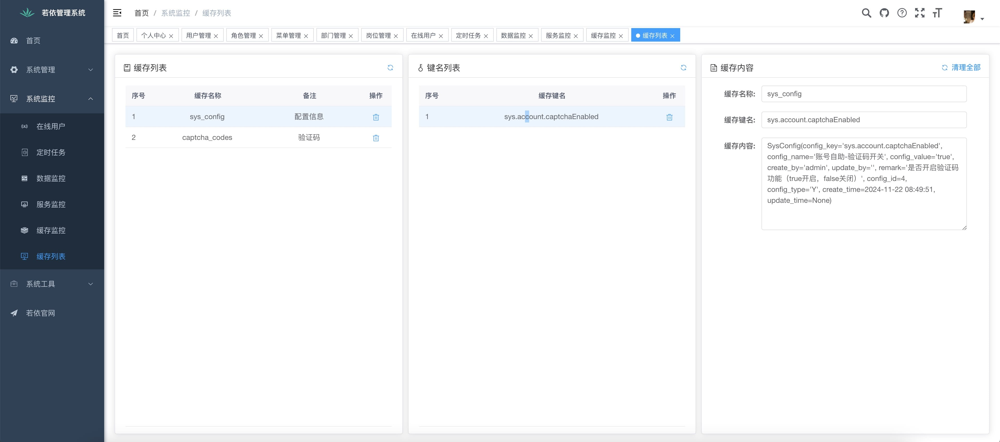

<h1 align="center" style="margin: 30px 0 30px; font-weight: bold;">Flask-Ruoyi-Admin v1.0.0</h1>
<h4 align="center">基于flask+ 若依（Vue2 | Vue3版本）快速开发后端框架</h4>
<p align="center">
	<a href="https://gitee.com/djsoftc/flask-ruoyi-admin/stargazers"></a>
	<a href="https://gitee.com/djsoftc/flask-ruoyi-admin"></a>
	<a href="https://gitee.com/djsoftc/flask-ruoyi-admin/blob/main/LICENSE"></a>
</p>

**Flask版本3.0.2及其其它相关依赖版本**

1.  Flask==3.0.2
2.  Flask-SQLAlchemy==3.0.2
3.  Flask-Login==0.6.3
4.  Flask-moment==1.0.6
5.  mysql-connector-python==8.0.33
6.  Flask-Excel==0.0.7
7.  pyexcel-xlsx==0.6.0
8.  Werkzeug==3.1.3
9.  bcrypt==4.2.0
10.  Flask-Caching==2.3.0
11.  captcha==0.6.0
12.  psutil==6.1.0
13.  APScheduler==3.10.4
14.  croniter==5.0.1
15.  flasgger==0.9.7.1

**python后台启动方式: python -m flask --app app run**

**前端代码基于RuoYi-UI(请前往若依项目下载)，后端接口通过flask重写的**

**项目结构**

      Flask Ruoyi Admin

      ├─web  # web应用
      │  ├─controller  # 控制器
      │  │  ├─system  
      │  │  └─tool
      │  ├─decorator
      │  ├─models   # 数据模型
      │  │  ├─common
      │  │  ├─system
      │  │  └─tool
      │  ├─routes
      │  ├─static  # 静态资源文件
      │  ├─task  # 定时任务
      │  ├─templates  # 静态模板文件
      │  └─utils  # 公共方法
      ├─doc  # 文档说明
      ├─requirement.txt  # 依赖文件
      ├─db.sql  # 数据库文件
      ├─config.py  # 项目的配置文件
      └─app.py  # 应用启动文件

**效果图**


|                        |                        |
| ---------------------- | ---------------------- |
|  |  |
|  |  |
|  |  |


**基于Python的Flask WEB框架实现后台权限管理系统，内容包含：**

1.  用户管理：用户是系统操作者，该功能主要完成系统用户配置。
2.  部门管理：配置系统组织机构（公司、部门、小组），树结构展现支持数据权限。
3.  岗位管理：配置系统用户所属担任职务。
4.  菜单管理：配置系统菜单，操作权限，按钮权限标识等。
5.  角色管理：角色菜单权限分配、设置角色按机构进行数据范围权限划分。（通过装饰器实现）
6.  字典管理：对系统中经常使用的一些较为固定的数据进行维护。
7.  参数管理：对系统动态配置常用参数。
8.  通知公告：系统通知公告信息发布维护。
9.  操作日志：系统正常操作日志记录和查询；系统异常信息日志记录和查询。（暂无。未写日志装饰器）
10.  登录日志：系统登录日志记录查询包含登录异常。
11.  在线用户：当前系统中活跃用户状态监控。（没对接redis，暂时监控不了）
12.  定时任务：在线（添加、修改、删除)任务调度包含执行结果日志。（通过APScheduler实现）
13.  代码生成：前后端代码的生成（python、html、model、sql）支持CRUD下载 。
14.  系统接口：根据业务代码自动生成相关的api接口文档。（通过flasgger实现 http://ip:端口/swagger-ui/index.html）
15.  服务监控：监视当前系统CPU、内存、磁盘、堆栈等相关信息。
16.  缓存监控：对系统的缓存信息查询，命令统计等。（通过Flask-Caching实现）
17.  在线构建器：拖动表单元素生成相应的HTML代码。
18.  连接池监视：监视当前系统数据库连接池状态，可进行分析SQL找出系统性能瓶颈。（无。使用Flask-SQLAlchemy）


## 在线体验

- admin/admin123

演示地址：http://liangyan.vip:5050


**使用方法**

flask后端启动：

虚拟环境安装项目（推荐）

> **💡提示** 为了保证项目所依赖的库不影响其他部署在同一主机上的项目，推荐使用虚拟环境安装。

   ```bash
   python -m venv venv
   # 进入虚拟环境下
   . venv/bin/activate  # Linux
   # 使用 pip 安装
   pip install -r requirements.txt
   ```

直接安装项目

   ```bash
   # 使用 pip 安装
   pip install -r requirements.txt
   # 同时你可以选择以模块的方式调用 pip
   python -m pip install -r requirements.txt
   ```

其他操作
1. mysql直接导入ruoyi的数据库sql即可(MYSQL需要8.0以上版本)
2. 或者导入根目录下db.sql数据库脚本到数据库中（db.sql对应的ry_20240629.sql）
3. 更改config.py DevConfig类下的数据库连接，提供用户名密码。
4. python3.x -m flask --app app run [-h 0.0.0.0] [-p 5000]
   
   说明一下：[]里面是可选项的，如果加上，请去掉中括号：
   
   python -m flask --app app run
   
   或
   
   python -m flask --app app run -h 0.0.0.0 -p 5000
   
   或
   
   pip install gunicorn
   
   gunicorn app:app -w 4 -b 0.0.0.0:5000
   
   其中 -w 4 表示使用 4 个工作进程，-b 0.0.0.0:5000 表示绑定到本地的 5000 端口，你可以根据实际需求进行调整。

   演示模式 传入参数 export demonstrate=1

6. 路由、权限、等装饰器写法
   
   @main_routes.route('/system/user/list', methods=['GET'])
   
   @login_required
   
   @permission('system:user:list')
   
   @dataScope('sys_user.create_by')
   表权限控制通过表的创建人进行过滤，权限配置参考若依文档

前端启动：（从ruoyi下载vue2或vue3的前端版本即可，全部兼容）

1. 安装Node.js
2. 进入源代码的ui目录。cd ui
3. npm install
4. npm run dev


nginx生产环境配置

             location / {
                 root /opt/flask-ruoyi-admin/ruoyiui;
                 try_files $uri $uri/ @router;
                 index index.html;
             }

             location /prod-api/ {
                 proxy_pass http://localhost:5000/;
                 proxy_set_header Host $http_host;
                 proxy_set_header X-Real-IP $remote_addr;
                 proxy_set_header X-Forwarded-For $proxy_add_x_forwarded_for;
              }


## flask-ruoyi-admin交流群

QQ群：[](http://qm.qq.com/cgi-bin/qm/qr?_wv=1027&k=IKDbdOnZXXiXBTLscDNoXFlD2nh78oWT&authKey=5w5YTJevaTd5bsa8gnGUvGUmymU%2F0w%2FEsljLzxUgNsRiGbJ7aWMiBxMPUIJqDR%2FL&noverify=0&group_code=536139819) 点击链接加入群聊